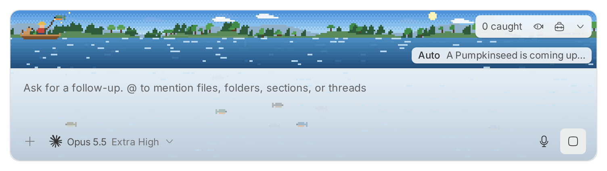

# Gone Fishing plugin

<p align="center">
  
</p>

A small pixel-art fishing pond that sits on top of the chat input of a thread,
joined to it as one box. You can fish only while the thread's agent works: the
pond opens when a turn starts and goes back to the dock when the turn ends.
While it is open, the chat input floods too: water rises into it, and fish swim
behind your text.

Fish at three maps through four seasons, and dress your angler, boat, and dog.
New maps and gear unlock as your fish book fills up.

## Inspiration

Gone Fishing is inspired by Cast n Chill, a cozy pixel-art fishing game by
Wombat Brawler. It's an amazing game that I quite enjoy and highly recommend.
I took inspiration from it to bring a bit of joy to my day-to-day tasks.

Gone Fishing isn't affiliated with Cast n Chill or Wombat Brawler. Its art and
code are original.

## Install

From the marketplace:

```sh
bb marketplace add git:github.com/charpeni/bb-plugins@main
bb plugin install gone-fishing@charpeni
```

Or directly from this repository:

```sh
bb plugin install git:https://github.com/charpeni/bb-plugins.git@^1.0.0 --tag-prefix gone-fishing/ --plugin gone-fishing
```

## How to play

- **Auto-fishing.** While the agent works, the pond casts, waits, and reels
  fish in by itself.
- **Take the rod.** Click the pond (or focus it and hold Space) to fish
  yourself. Click when a fish bites to hook it, hold to reel, and let go while
  the fish runs, or the line snaps. After 15 seconds without input, the pond
  goes back to auto-fishing.
- **The fish are real.** The fish swimming behind your text are the pond's
  fish, in their own colors. Every bite is one of them swimming up to the hook,
  and the status line names it on the way. Rare and legendary fish glint. A fish
  that gets away goes back into the pond, and new fish swim in over time.
- **Legendary fish** only land if you reel them in yourself. One that escapes
  auto-fishing stays in the pond, so watch for it and take the rod.
- **Time of day** follows your clock. Some fish only swim in at dawn, dusk, or
  night.
- **When the agent stops,** a fish already on the line still gets landed. Then
  a row above the chat input sums up the catch until the next turn or until
  you dismiss it.
- **Fish book.** Open it from the pond, the dock row, or the thread panel's
  new-tab menu. It lists every species, where it lives, how many you caught,
  and your best size (S, M, L, or XL for that species).

## Maps, seasons, and the tackle box

Open the **Tackle box** from the pond's toolbar or the thread panel's new-tab
menu. It previews the pond and lets you pick:

- **Map.** Pine Lake (pine hills, bass, pike, and lake trout), Birch River (a
  current past birches and boulders, with trout, eels, and salmon), and Cattail
  Marsh (willows, reeds, and lily pads, with bass, bowfin, and gar). Each map
  has its own fish: 28 species in all. Switching maps brings that map's fish;
  a fish already on the line stays hooked and counts for the map it came from.
- **Season.** Seasons follow your calendar: spring blossoms, summer fireflies
  at dusk, autumn leaves, and winter snow and ice. You can pin one instead.
- **Angler, boat, and dog.** Skin tone, hat, and jacket; boat style and paint;
  and the dog's coat, or no dog.

Skin tones are always available. Everything else below unlocks from your catch
log:

| Unlock                | How                            |
| --------------------- | ------------------------------ |
| Birch River           | Catch 6 species                |
| Cattail Marsh         | Catch 12 species               |
| Beanie                | Catch 25 fish                  |
| Bucket hat            | Land 3 XL fish                 |
| Rain slicker          | Catch 25 fish at Birch River   |
| Plaid flannel         | Catch 250 fish                 |
| Canoe                 | Catch 10 fish at Birch River   |
| Kayak                 | Catch 10 fish at Cattail Marsh |
| Red paint, blue paint | Catch 50 fish, 100 fish        |
| Green paint           | Catch 15 species               |
| Golden paint          | Land a legendary fish          |
| Spotted dog           | Catch 15 fish                  |
| Husky                 | Catch 30 fish at Cattail Marsh |
| Golden dog            | Land 3 legendary fish          |

A catch that unlocks something says so in the pond and in the dock row.

Clicking the pond does not move focus away from the chat input, so you can keep
typing. The flooded chat input works as usual. The water is a translucent
layer behind the text that ignores clicks, and it drains when the agent stops.

Hide the pond with its chevron button to keep only a one-line status and a dry
chat input. That preference is stored in the browser. On compact layouts, the
pond always shows as the one-line status.

bb has no plugin API for placing UI next to the chat input or for painting it.
Plugin banners render at the top of bb's card stack, above queued messages and
changed files. So the pond and the flood find the chat input through bb's
markup (`[data-app-composer]`, `[data-follow-up-composer-anchor]`, and
`form[data-promptbox]`). If a bb update changes that markup, the pond falls back
to bb's banner position and the chat input stays dry.

## Data

Catches are saved on the bb server in the plugin's own SQLite database: the
species, length, size tier, map, whether you or auto-fishing landed it, the
thread ID, and the time. Your look is saved in the plugin's key-value storage on the same server, so it
follows you between the desktop app and the browser. The server checks unlocks
when you save a look. The per-turn summary is kept in memory and resets when
the app reloads.

The pond animates at about 30 frames per second only while it is visible. When
it is hidden or off screen, it keeps fishing at four updates per second, or
whatever slower pace the browser allows in a background tab. With reduced
motion, the pond and the flooded chat input hold still and only redraw to show
what changed.
